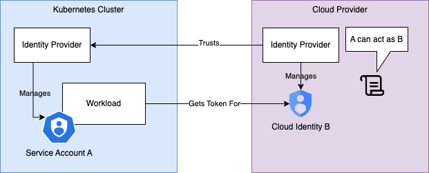

# How To Get Rid of Secrets in Kubernetes with Workload Identity Federation

When developing Software, we're interacting with secrets during all stages of development. 
In our applications, in CI/CD pipelines, and sometimes even for local development, if unavoidable. 
While we can take measures to limit the chance of leaking a secret, it is never zero. 
Good security practises and tools such as [detect-secrets](https://github.com/Yelp/detect-secrets) or [talisman](https://github.com/thoughtworks/talisman) 
can protect against some scenarios, but are not perfect. When a secret gets exposed, 
the impact highly depends on a few of its properties:

* **Being shared / being shareable**: Rotating shared secrets can be expensive or take time, as multiple parties might need to update it.
* **Being nonpersonalized**: Access logs can be useful to investigate security issues.
However, if it can not be determined who accessed an asset because the credentials are not tied to an identity,
an audit trail might be harder to follow.
* **Being long-lived**: In many cases, the fact that a secret has been exposed 
will not become apparent for a long time. If it doesn't expire and doesn't get rotated often, 
a potential attacker has a long window of opportunity to exploit the leak.
* **Being too powerful**: If a secret provides access to much more data/assets than necessary, 
a leak can be much more severe. 

An example of a terrible secret is the account key for an azure storage account.
There are only two keys available for each account, one of which is supposed to be used at a time,
while the other can be used for a smooth rotation.
The credentials can not be limited in power, are not bound to an identity and do not expire,
ticking most of the boxes in the list above.
When one is exposed, all data on the account is available to an attacker (can be petabytes).
While some services [exclusively support them](https://docs.fluentbit.io/manual/pipeline/outputs/azure_blob) as an access method,
they are actively [discouraged by Microsoft](https://learn.microsoft.com/en-us/azure/storage/common/storage-account-keys-manage#protect-your-access-keys:~:text=Microsoft%20recommends%20using%20Azure%20Active%20Directory%20(Azure%20AD)%20to%20authorize%20requests%20against%20blob%2C%20queue%2C%20and%20table%20data%20if%20possible%2C%20rather%20than%20using%20the%20account%20keys%20(Shared%20Key%20authorization)).
Microsoft instead recommends using role assignments and other identity based authentication options.

## Identity based Access for automated Workloads

Classically, to enable identity based access for kubernetes workloads, such as application pods or jobs, 
an identity is created as a cloud resource.
Examples of such identities are Azure Service Principals or GCP Service Accounts.
Then, a secret is generated and stored where the identity is used. In Kubernetes, it is usually stored in a Kubernetes Secret, 
and injected into the workload.
Together with solid security practices within Kubernetes, like the use of Kubernetes [RBAC (Role based Access Control)](https://kubernetes.io/docs/concepts/security/rbac-good-practices/) and namespace isolation, 
this is already a step up from using anonymous credentials. However, these secrets are usually still quite long-lived and need to be rotated (and therefore moved) regularly.
Luckily, there is a way to completely get rid of those secrets for good and instead only rely on short-lived tokens
for many common scenarios.

## Workload Identity Federation for Kubernetes

On a high level, workload identity federation allows the identity provider in the cloud (the one issuing tokens for GCP service accounts)
to trust the identity provider in kubernetes (the one issuing tokens for kubernetes service accounts), 
so that an application running in a kubernetes pod can exchange a token for it's service account for a token
for the service account in the cloud.




Here's some example terraform code to create a cloud identity (user assigned identity on azure, service account on GCP)
along with the association to a kubernetes service account, identified by the namespace and service account name.


=== "Azure"

    ```hcl
    resource "azurerm_user_assigned_identity" "example" {
      location            = "west-europe"
      name                = "<some-cloud-identity-name>"
      resource_group_name = "<resource-group-name>"
    }
    
    resource "azurerm_federated_identity_credential" "example" {
      name                = "example"
      resource_group_name = "<resource-group-name>"
      audience            = ["api://AzureADTokenExchange"]
      issuer              = "https://oidc.prod-aks.azure.com/<cluster-issuer-id>/"
      parent_id           = azurerm_user_assigned_identity.example.id
      subject             = "system:serviceaccount:<namespace-name>:<service-account-name>"
    }
    ```

=== "GCP"

    ```hcl
    resource "google_service_account" "example" {
      account_id   = "<some-cloud-identity-name>"
      display_name = "My GCP cloud identity"
      project      = var.project_id
    }
    
    resource "google_service_account_iam_member" "main" {
      service_account_id = google_service_account.example.account_id
      role               = "roles/iam.workloadIdentityUser"
      member             = "serviceAccount:${var.project_id}.svc.id.goog[<namespace-name>/<service-account-name>]"
    }

    ```
    !!! warning
        Note that this configuration does not reference the name of the GKE cluster, and will equally apply to [all GKE clusters in a project](https://cloud.google.com/kubernetes-engine/docs/concepts/workload-identity#identity_sameness).
        An attacker could take advantage of this if one cluster is not protected sufficiently (for example when exploring or migrating).
    

On kubernetes side, a pod using workload identity can be configured as usual, with a few additions:

=== "Azure"
    ```yaml hl_lines="5 15 17"
    apiVersion: v1
    kind: ServiceAccount
    metadata:
      annotations:
        azure.workload.identity/client-id: <client-id-of-azure-identity>
      name: <service-account-name>
      namespace: <namespace>
    ---
    apiVersion: v1
    kind: Pod
    metadata:
      name: <some-pod-name>
      namespace: <namespace>
      labels:
        azure.workload.identity/use: "true"
    spec:
      serviceAccountName: <service-account-name>
      containers:
        - ...
    ```

=== "GCP"
    ```yaml hl_lines="5 15 17"
    apiVersion: v1
    kind: ServiceAccount
    metadata:
      annotations:
        iam.gke.io/gcp-service-account: <cloud-identity-name>@<project-id>.iam.gserviceaccount.com
      name: <service-account-name>
      namespace: <namespace>
    ---
    apiVersion: v1
    kind: Pod
    metadata:
      name: <some-pod-name>
      namespace: <namespace>
    spec:
      serviceAccountName: <service-account-name>
      nodeSelector:
        iam.gke.io/gke-metadata-server-enabled: "true" #Needed if workload identity is not enabled on all nodepools
      containers:
        - ...

    ```

If these resources are deployed to a cluster that has workload identity enabled, 
additional environment variables and a volume containing a token will be injected into the pod.

At this point, using workload identities becomes very straightforward if the client libraries provided by 
the cloud providers already support it. Here is a few examples accessing cloud resources:

=== "Azure Key Vault"

    ```python
    from azure.keyvault.secrets import SecretClient
    from azure.identity import DefaultAzureCredential
    
    def main():
        credential = DefaultAzureCredential()
        keyvault_client = SecretClient(vault_url="<some-keyvault-url>", credential=credential)
        secret = keyvault_client.get_secret("<some-secret-name>")
        do_something_with_secret(secret.value)
    
    if __name__ == '__main__':
        main()
    ```

=== "GCP Secret Manager"

    ```python
    from google.cloud import secretmanager
    
    def main():
        client = secretmanager.SecretManagerServiceClient()
        name = f"projects/<project_id>/secrets/<secret_id>/versions/latest"
        response = client.access_secret_version(request={"name": name})
        secret_value = response.payload.data.decode("UTF-8")
        do_something_with_secret(secret_value)
    
    if __name__ == '__main__':
        main()
    ```

As visible, both Azure and GCP provide good support to hide the complexity that comes with workload identity.

## What if secrets are unavoidable?

While it is relatively easy to access resources in the own cloud provider using workload identities, external
dependencies often don't offer the possibility. For example, a monitoring platform like [Datadog](https://www.datadoghq.com/)
might only offer authentication using api keys. 
Even in this case, workload identities offer some advantages in conjunction with cloud secret stores.
Like in the previous code example, an external secret can be stored in a secret manager and accessed from the
pod directly, circumventing the need to create kubernetes secrets from a pipeline and injecting it into the pod via environment variables.


If the component needing access to the secret is not a custom application, there are [CSI Drivers](https://secrets-store-csi-driver.sigs.k8s.io/introduction.html) available to sync
secrets from secrets stores into kubernetes (as mounted volumes or additionally as kubernetes secrets).
However, there are [security tradeoffs](https://secrets-store-csi-driver.sigs.k8s.io/topics/best-practices.html) when compared with direct integration via an API.


## What if components can only work with long-term credentials?

Sometimes, when deploying generic components without custom code, it is not straightforward to work with tokens
instead of long-lived secrets. For example, a service like [Backstage](https://backstage.io/docs/getting-started/configuration#install-and-configure-postgresql)
might depend on a Postgres database as a backend. While postgres in Azure and GCP both support identity based auth,
the tool in question might only allow configuration of a fixed username/password.
Here are a few approaches how to approach this issue:

### Contribute to open source
Sometimes, it is easiest to raise a pull-request with an open source project,
than to find workarounds to address limited support.
That could mean adding the ability to configure a function instead of a static configuration value to fetch a password,
enabling a backend to function with default credentials for major cloud providers or just adding a missing setting to
a helm chart.
This has the added benefit of contributing to the community and also saves maintenance efforts for custom adaptions.
In many cases, it can also be enough to check and vote for an existing issue or to raise a new one,
if a direct contribution is unrealistic.

### Sidecars, Refreshers and Proxies
It is often possible to add sidecars to containers that update credentials. 
In the case of postgres, they could fetch a credential in regular intervals and share it with the other container via a shared volume.
Whether this works or not might still depend, as not every component will react to changes at runtime.
A more drastic option is a component that forces a pod recreation whenever a secret expires or is about to expire.
If the kubernetes resources are configured appropriately, that would not have any impact on availability.
Another option is to put a proxy between the application and the external dependency it is trying to access.
For Google Cloud SQL, there is [an option available](https://cloud.google.com/sql/docs/postgres/sql-proxy#cloud-sql-auth-proxy-docker-image) 
that can be deployed within a namespace or as a sidecar.

!!! tip
    Something to keep in mind when considering these options is whether the benefits for security
    actually outweigh the additional architectural complexity. 
    [Thread Modelling](https://martinfowler.com/articles/agile-threat-modelling.html) can help with prioritisation.


## Key Takeaways
* Secrets are omnipresent and important in software, but can pose a risk if they are weak, long-lived, powerful or shared or not identity-based
* Everytime a secret is moved between places, there is a risk of exposing it, so movement should be minimized
* Workload Identity Federation, along with fine-grained permissions, is a powerful way to eliminate persistent secrets

## Related Resources
[Azure Workload Identity](https://azure.github.io/azure-workload-identity/docs/)

[GKE Workload Identity](https://cloud.google.com/kubernetes-engine/docs/how-to/workload-identity)

[AWS Pod Identity](https://github.com/aws/amazon-eks-pod-identity-webhook)


